# Project Title

#### FIFA World Cup 2018 website using laravel.

### Installing

Copy the repository to xampp/htdocs or wampp (http/)
```
$ git clone git@github.com:vcshahriyer/WorldCup2018.git
```

Run this commands:
```
$ composer install
```
```
$ cp .env.example .env 
```
```
Create database and
Import database from public/sql folder.
```
Now edit .env file with the database name and user password.

### Project details
1.Home page
   - Recent match preview.
   - Recent News preview.
   - Recent videos.
   - Search players and teams.
   - Stadiums list.
   - Short point table.

### Home page:
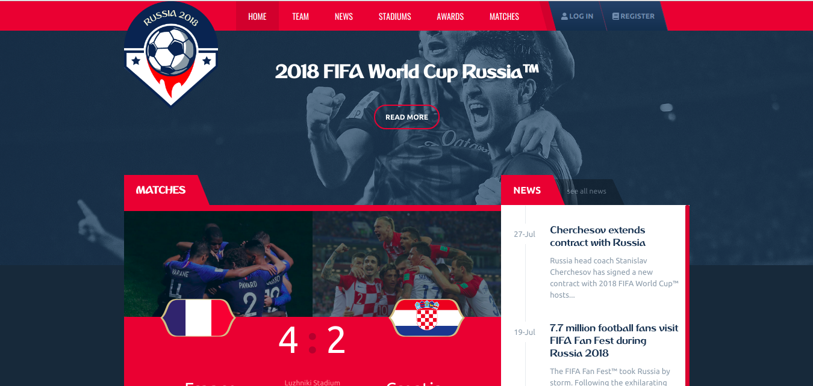

##### Search team or individual player:
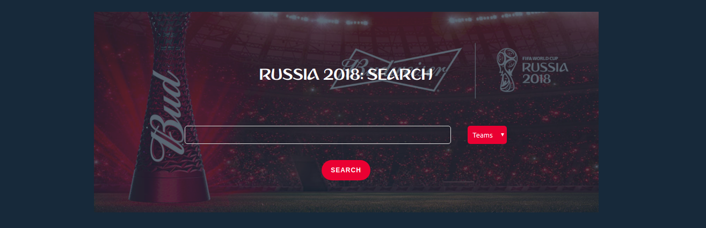

##### Recent videos:
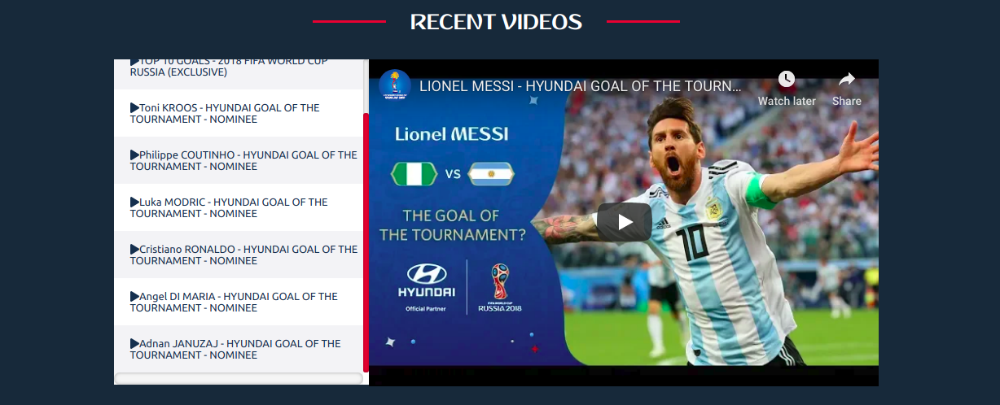

##### Short previews:
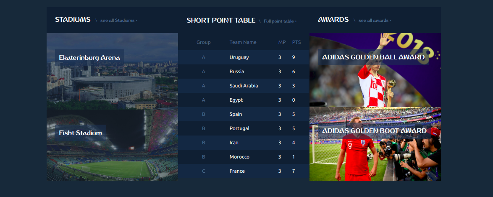

2.All Team page
   - All teams card view
   - Dynamic slider gallery
##### Card view of teams:
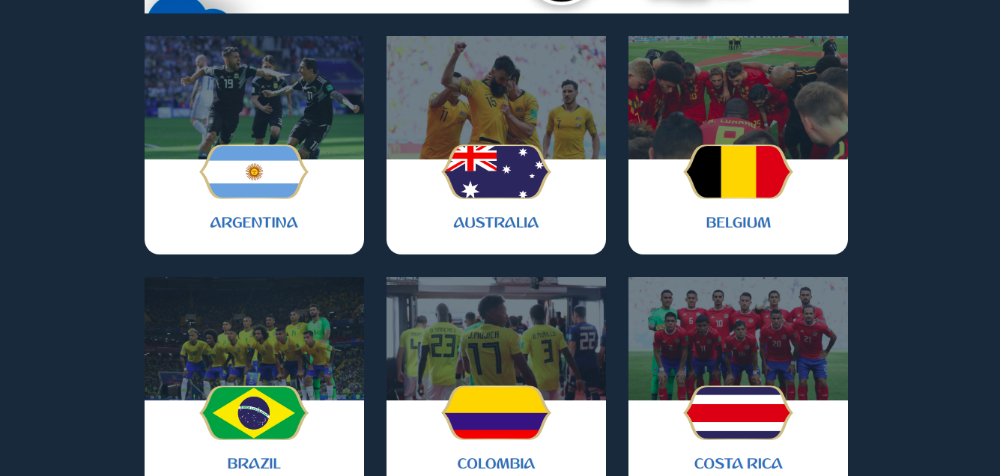
##### Dynamic slider:


3.News page
##### Recent news:
 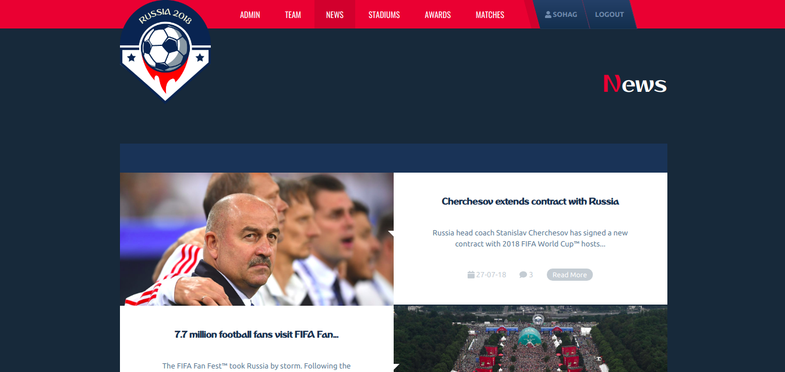

4.Stadiums page
##### Kaliningrad Stadium:
 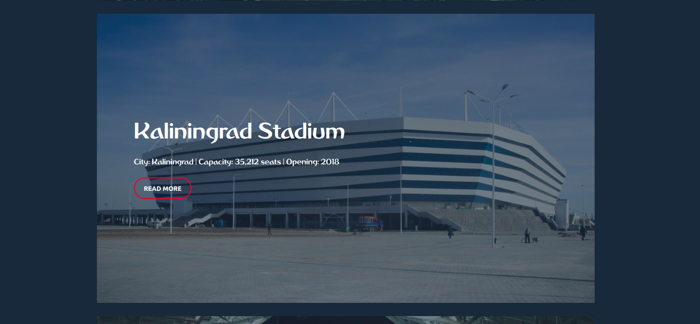
 
5.Awards page
   - All Awards
##### Golden-boot award:
 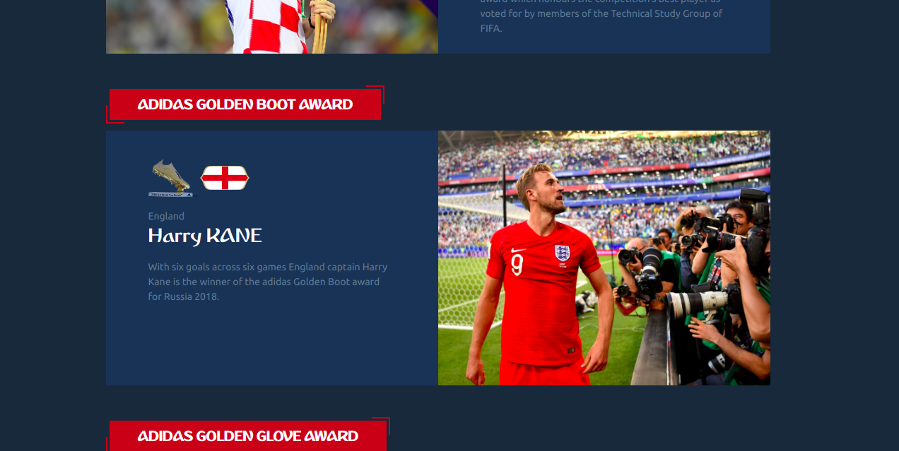
 
6.Matches page
   - All matches
   - Group matches
##### All matches:
 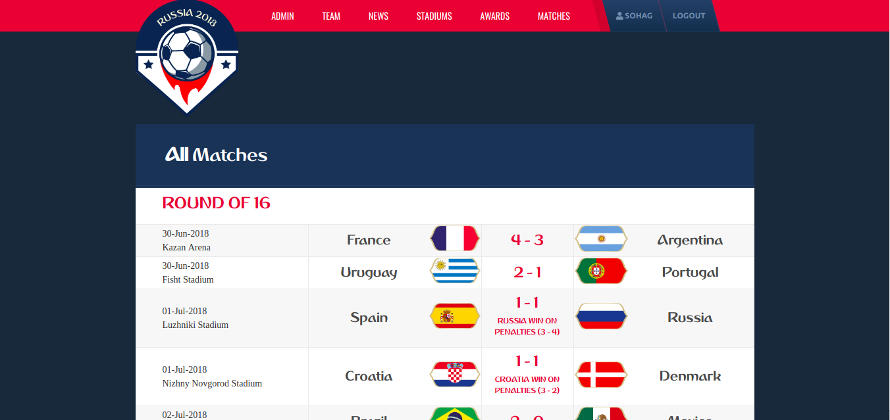
##### Group matches:
 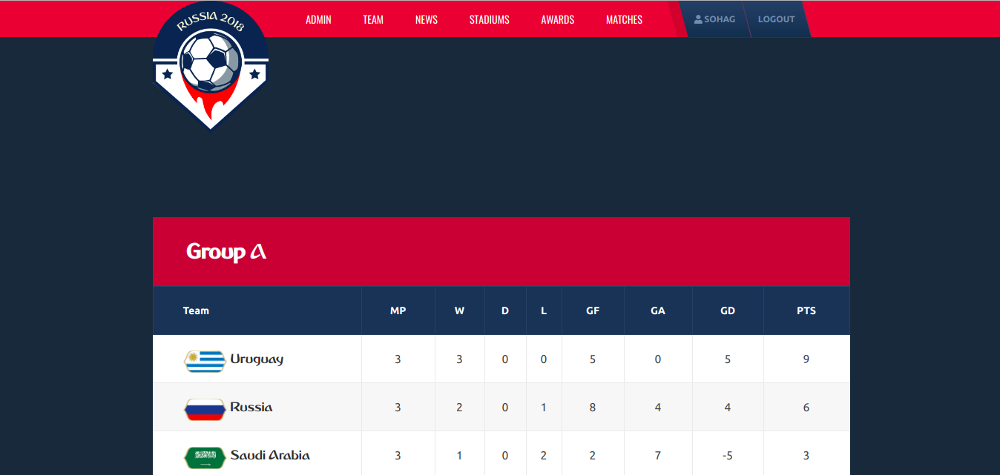
 
7.Dashboard
   - Dashboard for only manager account
   - Create role for user
   - Insert entry for Players,News etc...
##### Dashboard:
 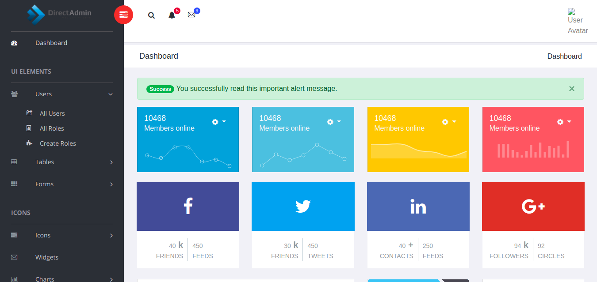
##### Create role:
 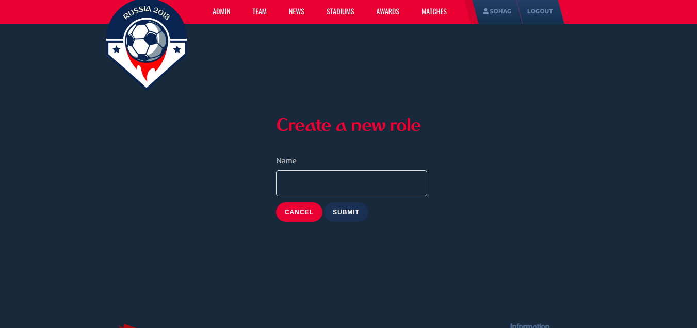  